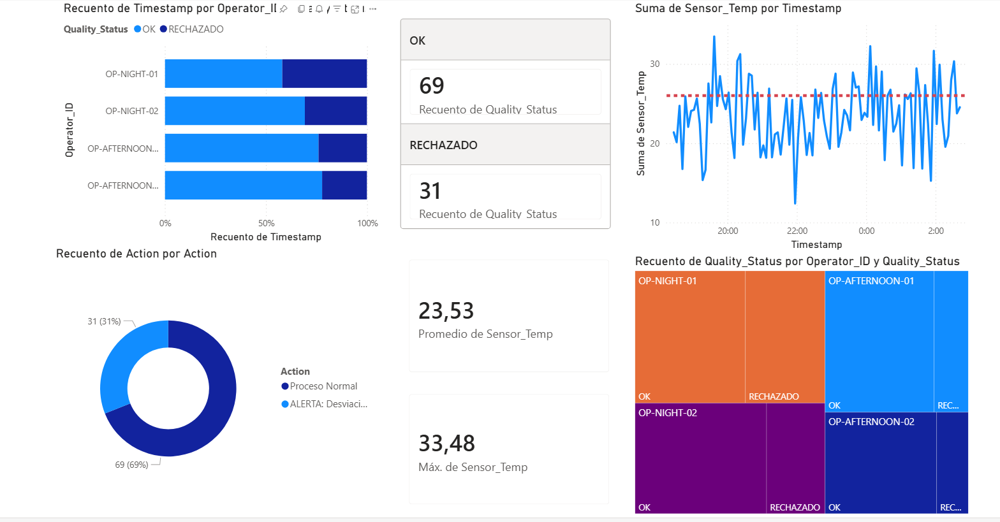

# MES Production Audit Trail Analysis 🏭📊
This project simulates and analyzes data from a **Manufacturing Execution System (MES)** in a pharmaceutical production environment. It focuses on quality control, environmental monitoring (temperature), and operator performance tracking.

## 🚀 Project Overview
The goal is to monitor a production line where temperature excursions directly impact product quality. The system tracks 150 production events, identifying correlations between sensor data, shifts, and batch success rates.

## 🛠️ Tech Stack
* **Python**: Data simulation using `pandas` and `numpy`.
* **Power BI**: Interactive dashboard for real-time KPIs and trend analysis.
* **GitHub**: Version control and documentation.

## 📋 Data Dictionary (Variables)
| Variable | Description |
| :--- | :--- |
| **Timestamp** | Exact date and time of the recorded event. |
| **Batch_ID** | Unique identifier for the production lot (Essential for Pharma traceability). |
| **Operator_ID** | Unique ID for the operator on shift (categorized by Morning, Afternoon, and Night). |
| **Sensor_Temp** | Critical process parameter (°C). Target is < 26.0°C. |
| **Quality_Status** | Categorical: `OK` (within specs) or `RECHAZADO` (excursion detected). |
| **Action** | System response: `Proceso Normal` or `ALERTA: Desviación Térmica`. |
| **Machine_State** | Operational status: `Running` or `Stopped` (automatic interlock). |

## 📈 Dashboard Insights & Conclusions

Based on the Power BI analysis:

1.  **Thermal Stability**: The line shows a high sensitivity to temperature. The **Max Temperature recorded (33.48°C)** triggered immediate system stops to prevent batch contamination.
2.  **Quality Yield**: Out of 100 monitored events, **69% were successful (OK)** while **31% were rejected**. This indicates a need for better cooling system calibration.
3.  **Operator Performance**: 
    * `OP-NIGHT-01` and `OP-NIGHT-02` face the highest number of rejections, suggesting that environmental conditions or fatigue during the night shift may affect process stability.
    * `OP-AFTERNOON-01` shows the most stable "OK" ratio.
4.  **Operational Risk**: The **Donut Chart** confirms that 31% of total actions are Alarms, which directly correlates with the peaks shown in the **Temperature Trend** line chart.

## ⚙️ How to Run
1.  Run the `mes_simulation.ipynb` script to generate the latest `MES_Pro_Production_Data.csv`.
2.  Open the `MES_project2.pbix` file in Power BI Desktop.
3.  Refresh the data source to visualize the updated manufacturing metrics.

---
*Developed as a technical showcase for Manufacturing Systems & Data Analysis.*
